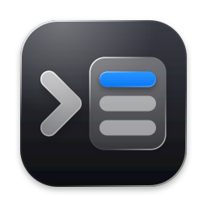
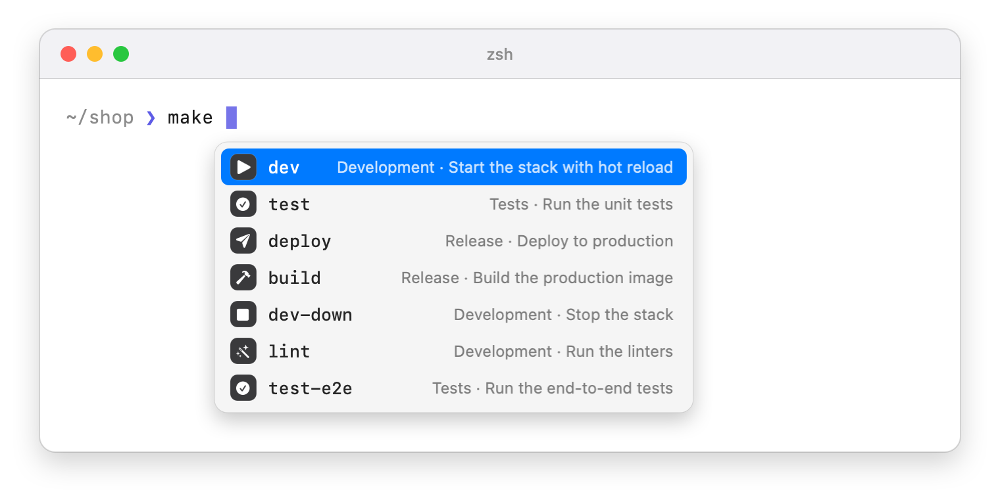
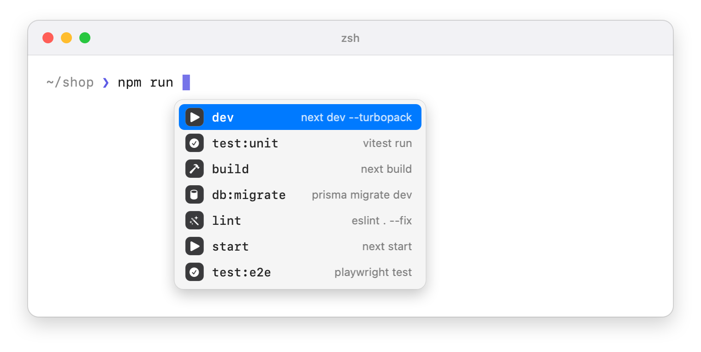
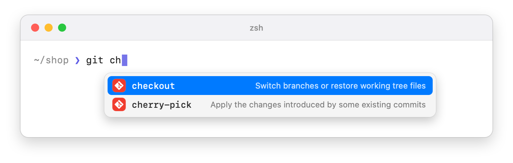
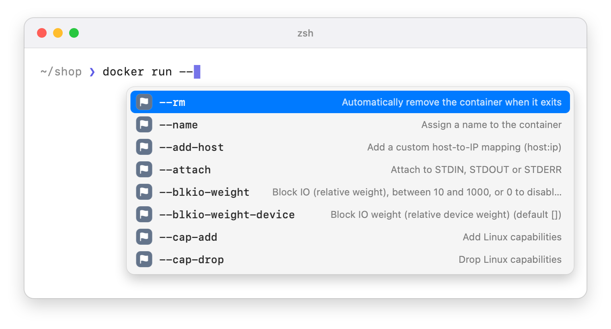
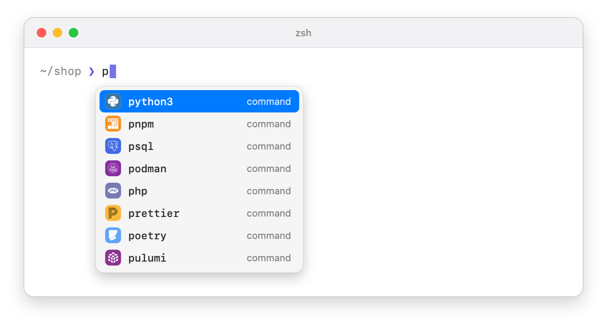

# Figxit

IDE-style autocomplete for the macOS terminal, for zsh, bash, and fish. Figxit completes commands, subcommands, options, `package.json` scripts, and Makefile targets as you type, ordered by what you use most in the current project.

It is a free, open source replacement for Fig's autocomplete. It runs locally, with no account, no AI chat, and no telemetry.

<picture>
  <source media="(prefers-color-scheme: dark)" srcset="docs/img/scene/make-dark.png">
  
</picture>

## Why it exists

Fig added autocomplete to the terminal: you typed `git ` and got the subcommands, each with a short description. Fig joined AWS in 2023 and the app was shut down in September 2024. Its autocomplete now ships inside Kiro CLI, a closed-source AI agent tool.

The open alternatives each lack a part of what Fig did:

- Shell completion menus open only when you press Tab, and they do not know which command you use most.
- Tools that draw the list inside the terminal wrap the shell session to do it.
- History search finds a full past command, but it does not list what a command can do.

Figxit has all three: a list that opens while you type, completion data for 700+ tools, and ranking from your own history.

## What it does

### Project targets and scripts

`make ` lists the targets of the `Makefile` in the current folder. `npm run `, `pnpm `, `yarn `, and `bun run ` list the scripts of `package.json`.

The icon comes from the verb in the name: `dev`, `start`, and `serve` share one shape, `test` and `test:e2e` share another, and `dev-down` gets the stop shape. One list of 12 verbs covers most script and target names in popular open source projects.

<picture>
  <source media="(prefers-color-scheme: dark)" srcset="docs/img/scene/scripts-dark.png">
  
</picture>

For a `Makefile`, the right column shows the comments that many projects already write:

```make
##@ Development
dev: ## Start the stack with hot reload
dev-down: ## Stop the stack

##@ Tests
test: ## Run the unit tests
```

`##@` starts a section and `##` after a target is its help text. Both are optional.

### Subcommands and options for 700+ tools

Figxit loads the open source Fig completion specs. Type a command and a space for its subcommands, or a dash for its options. Options that are already on the line are hidden.

<picture>
  <source media="(prefers-color-scheme: dark)" srcset="docs/img/scene/git-dark.png">
  
</picture>

<picture>
  <source media="(prefers-color-scheme: dark)" srcset="docs/img/scene/options-dark.png">
  
</picture>

<picture>
  <source media="(prefers-color-scheme: dark)" srcset="docs/img/scene/commands-dark.png">
  
</picture>

Specs can also supply live values, for example git branches after `git checkout `, hosts after `ssh `, and files and folders where a command takes a path.

### Ranking from your history

Figxit reads your [Atuin](https://atuin.sh) history database, read-only. A word scores higher when you used it in the same folder, in the same repository, or recently. Without Atuin the popup still works, in the order the sources give.

For a command that has a spec, history from other folders is not shown. This keeps scripts from one project out of the list in another.

### Keys

| Key | Action |
|---|---|
| Up, Down | Move the highlight. A row is highlighted after you type part of it or press Up or Down. The first Down highlights the first row |
| Tab | Insert the highlighted row. When no row is highlighted, insert the first row |
| Enter | On a normal row: insert it, when you typed part of it or moved to it. It does not run the line. On the run row (the return icon, shown first when the typed word is complete): run the line. In all other cases, run the line as typed |
| Esc | Close the popup |
| Ctrl-U or more typing | Close the popup |

When the popup is closed, the keys do what they did before. Tab still opens your normal completion and Up still searches your history.

## Conventions

Figxit uses three conventions that many projects already follow. All are optional.

### Makefile help

| You write | Figxit shows |
|---|---|
| `dev: ## Start the stack` | The text after `##` as the description of `dev` |
| `##@ Development` | A section name in front of the descriptions below it |
| `release: ## [prod] Publish the app` | A red icon on `release`. The tag is not shown in the popup |

The tags are `[prod]`, `[production]`, `[danger]`, and `[caution]`. A help command made with the usual `awk` line still works, and prints the tag.

### Icons from the name

The verb in a target or script name selects the icon: `dev`, `start`, and `serve` share one, `test` another, `build` another. The list of 12 verbs is in `engine/src/verbs.ts`.

### Red icon for production

A red icon marks a row that touches production. A row gets it in one of three ways:

| Rule | Examples |
|---|---|
| The name is written in capitals | SSH host `PROD`, target `DEPLOY`, script `MIGRATE` |
| The name has the word `prod` or `production` | `deploy:prod`, `build:production`, `api-prod`, `prod-db-1` |
| A Makefile target has a tag in its help text | `release: ## [prod] Publish the app` |

The rule applies to Makefile targets, `package.json` scripts, and live values such as SSH hosts and Docker contexts. It does not apply to files, to subcommands and options, or to words from your history. Only the icon colour changes.

## Requirements

- A Mac with Apple Silicon.
- macOS 13 or later. The glass background needs macOS 26 or later.
- zsh, bash 5 or later, or fish 4, in tmux or directly in a terminal that reports its cursor position. The `/bin/bash` of macOS is version 3.2 and does not work.
- tmux is optional. In tmux, each terminal app works. Without tmux, the popup is tested in Ghostty, iTerm2, and Terminal. WezTerm, Alacritty, and kitty are not tested yet without tmux.
- Atuin, optional, for ranking.

No Accessibility or Screen Recording permission is needed.

## Install

1. Download [Figxit.dmg](https://figxit.com/download/Figxit.dmg), open it, and drag Figxit to Applications.
2. Open Figxit. An icon appears in the menu bar and a setup window opens.
3. The setup window shows the line for your login shell. Click the **Add** button, or copy the line and add it yourself:

```bash
# zsh, in ~/.zshrc
eval "$('/Applications/Figxit.app/Contents/MacOS/figxit-engine' init zsh)"

# bash, in ~/.bashrc, or in ~/.bash_profile if that file does not load ~/.bashrc
eval "$('/Applications/Figxit.app/Contents/MacOS/figxit-engine' init bash)"

# fish, in ~/.config/fish/conf.d/figxit.fish
status is-interactive; and '/Applications/Figxit.app/Contents/MacOS/figxit-engine' init fish | source
```

4. Open a new terminal or a new tmux pane and type a command.

The line also defines the `figxit` command in your shell, so nothing needs to be on your PATH.

### The menu bar icon

The icon shows that Figxit is running. It is dimmed when the engine is stopped. Its menu has:

- **Pause Suggestions** and **Restart Engine**
- **Set Up Shell**, which opens the setup window again
- **Run Doctor**, which checks each part of the installation
- **Launch at Login**
- **Check for Updates**, which downloads and installs a new version
- **Check for Updates Automatically**, on by default. Clear it to stop the daily check
- **Quit Figxit**

### The `figxit` command

| Command | Action |
|---|---|
| `figxit init zsh` | Print the lines that load Figxit in zsh. `init bash` and `init fish` do the same for those shells |
| `figxit start` | Start the popup helper and the engine |
| `figxit stop` | Stop them |
| `figxit doctor` | Check each part of the installation |
| `figxit --version` | Print the version |

## How it works

Figxit has three parts that talk over unix sockets in `~/.local/state/figxit/`.

```
 shell adapter  ── buffer, cursor, folder ──▶  engine  ── rows, grid position ──▶  helper
 (zsh, bash, fish)                              (Bun)                               (Swift, AppKit)
      ▲                                           │
      └───────── text to insert on Tab ───────────┘
```

**Adapter** (`shell/zsh/figxit.zsh`). A zsh line editor hook sends the buffer to the engine after each key and does not wait for the answer. The shell waits for the engine only when you press Tab or Enter with the list open, for 300 ms at most. It binds Tab, Enter, Up, and Down, and runs your own binding when the list is closed.

**Bridge for bash and fish** (`engine/src/bridge.ts`, `shell/bash/figxit.bash`, `shell/fish/figxit.fish`). These shells cannot open a unix socket or watch one. Each shell starts one bridge process, `figxit-engine bridge`, which holds the engine connection for that shell. The adapters use shell builtins only, so no process starts for a key.

- bash binds each printable key and each editing key to a macro: the original function, then a hook that writes the buffer to the bridge through a pipe. Tab, Enter, Up, and Down first ask if the popup is open, and run their original binding if it is not.
- fish adds the hook to its existing bindings. It has no pipe that stays open, so it appends each line to a file in `~/.local/state/figxit/shell-<pid>/` that the bridge watches, and reads the popup state and the replies from files in the same folder.

**Engine** (`engine/`). A Bun process that keeps your history and the loaded specs in memory. For each key it parses the line, collects candidates from the project files, the spec, and your history, merges and ranks them, and sends the visible rows to the helper. Values that need a command (git branches, for example) arrive in a second pass, so the first rows are never delayed.

**Helper** (`helper/`). A small macOS app with no Dock icon. It starts the engine and restarts it after a crash. It shows a floating panel that does not take keyboard focus. It finds the terminal window through the public window list. In tmux, tmux supplies the pane offset, the cursor cell, and the cell size in pixels. Outside tmux, the terminal supplies the cursor cell and the cell size. In zsh and bash the question goes out when a new word starts, and the answer is read as a key sequence, so typed keys keep their order. In fish the bridge asks and reads the answer while the key hook waits, and it does not ask while more typed keys are waiting. The helper hides the popup when you switch app, window, or tab.

## Configuration

| Setting | Effect |
|---|---|
| `FIGXIT_SPECS=/path` | Folder of completion specs. `off` turns specs off |
| `FIGXIT_ATUIN_DB=/path` | History database to read |
| `defaults write dev.figxit.helper glass -bool false` | Use the classic background in place of glass |

The verb list for icons is in `engine/src/verbs.ts`. The command to logo map is in `engine/scripts/icons.ts`, and `cd engine && bun run scripts/icons.ts` rebuilds the icon set.

## Limits

- bash and fish: the popup is off in vi mode. In bash, keys with a character outside ASCII, a paste, and a Tab completion do not update the popup until the next key.
- bash: each key clears and draws the input line again, which is how bash runs a key hook.
- fish, outside tmux: a key that is not text, Enter, Tab, or Backspace is lost, with the keys typed after it, if it arrives in the short time in which the bridge reads the cursor position.
- bash and fish: each shell keeps one bridge process, about 28 MB.
- Outside tmux, the popup stays hidden in a native split of the terminal app, because the window list gives the window and not the pane. Use one pane for each window or tab, or use tmux for splits.
- Outside tmux, the popup stays hidden in a terminal that does not answer a cursor position query. In a terminal that does not report its cell size, the position is correct only with no tab bar and no split.
- Outside tmux, a terminal that keeps all its tabs in one window does not tell Figxit about a tab switch. The popup closes at the next key.
- macOS only.
- Escape does not close the popup yet.
- After an option that ends in `=`, values are not suggested yet.
- Spec generators that search the network on each key are turned off.
- Generators that need a live service, for example `kubectl get`, show nothing when the service does not answer in 1.5 seconds.

## Development

```bash
make dev      # run the helper and the engine from source, with reload
make test     # unit tests
make e2e      # end-to-end test for zsh, bash, and fish in a private tmux server, with and without tmux geometry
make smoke    # build the app and test the bundle and the figxit command
make build    # build and sign dist/Figxit.app
make dmg      # build the disk image with the drag-to-Applications window
```

Builds get an ad hoc signature, which is enough to run the app on your own Mac. Signed releases are made by the owner, see [docs/RELEASING.md](docs/RELEASING.md).

`make build` needs [Bun](https://bun.sh) and the Xcode command line tools. Run `bun install` in `engine/` one time first. `make dmg` also needs `create-dmg` and `rsvg-convert` from Homebrew.

For development, source the adapter from the repository in place of the `eval` line:

```bash
source /path/to/figxit/shell/zsh/figxit.zsh      # zsh
source /path/to/figxit/shell/bash/figxit.bash    # bash
source /path/to/figxit/shell/fish/figxit.fish    # fish
```

From the repository, the bash and fish adapters run the bridge with `bun run engine/src/main.ts bridge`.

With that line the adapter starts nothing by itself. `make dev` runs the helper and the engine in the foreground and reloads the engine when its source changes. Ctrl-C stops both.

The end-to-end test starts its own tmux server and a stand-in for the helper, so it does not touch your running session. Set `FIGXIT_E2E_SHELL=bash` or `fish` to run one shell, and `FIGXIT_E2E_PLAIN=1` to run without tmux geometry. Set `FIGXIT_E2E_REAL=1` to run the zsh test with your own `~/.zshrc`.

## Privacy

Figxit has no telemetry: the app does not report what you type, what you run, or how you use it.

Its only network request is the update check, one time each day, which reads one file from figxit.com. We count those checks by app version, and we count downloads of the app. That is how we know how many installs are in use. The count holds the version and the date, with no IP address and no identifier. To stop the check, clear **Check for Updates Automatically** in the menu.

Figxit reads your history database and the files in the current folder. Completion specs can run local commands to list values, for example `git branch`. They do not run when the line contains quotes, `$`, or other shell syntax.

Words from your history that look like a secret are not shown: a value after `--token` or `--password`, an assignment such as `API_KEY=...`, and long random strings. This filter cannot find all secrets, for example a password written directly after `-p`.

## Credits

- Completion specs: [withfig/autocomplete](https://github.com/withfig/autocomplete), MIT licence.
- Product icons: [Simple Icons](https://simpleicons.org), CC0 licence. The logos are trademarks of their owners.
- Updates: [Sparkle](https://sparkle-project.org), MIT licence.
- Figxit is not affiliated with Fig, Amazon, or Kiro.

## Licence

MIT. See [LICENSE](LICENSE).
