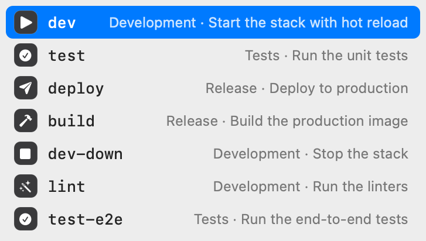
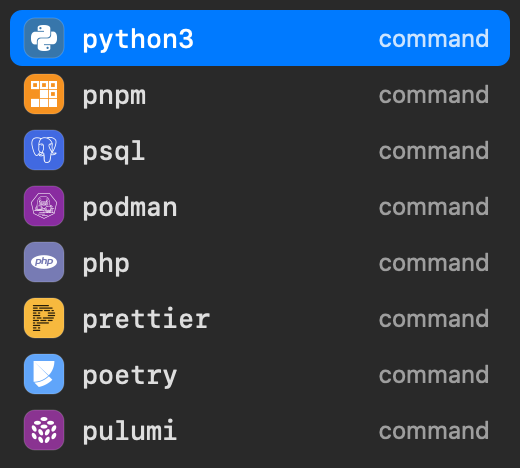
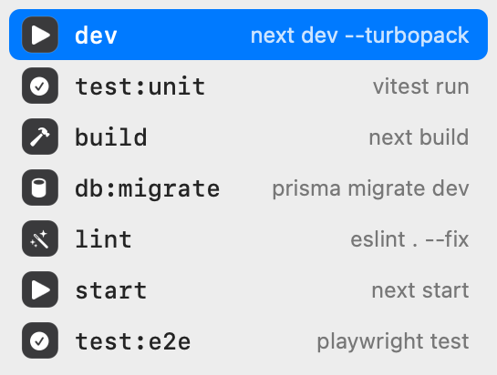
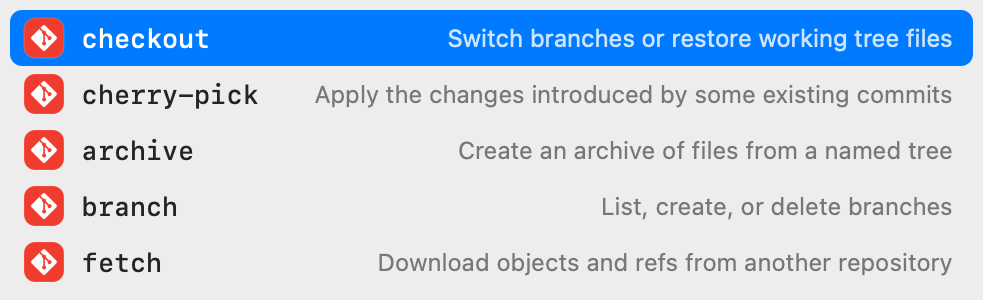
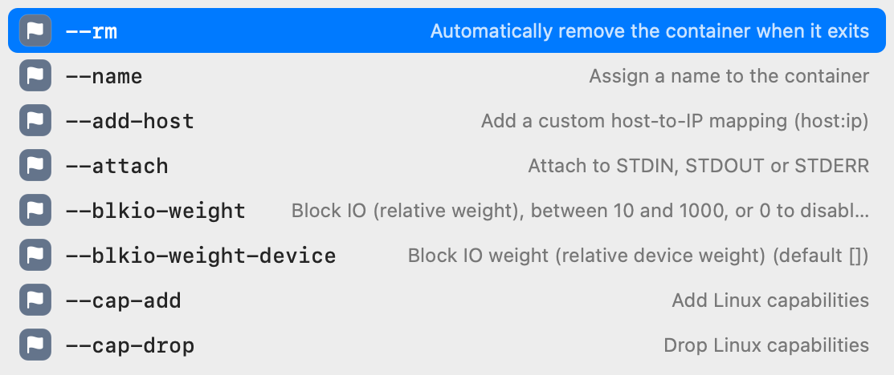

# Figxit

A native autocomplete popup for your terminal. It opens under the cursor as you type and lists the commands, subcommands, options, scripts, and targets that fit, ordered by what you use most in the current project.

It is the completion part of Fig, rebuilt as a small local tool: no account, no AI chat, no telemetry.

<p>
  
  
</p>

## Why it exists

Fig made the terminal easier to use. You typed `git ` and saw what you could do next, with a short description on each row. Fig was then acquired and folded into a larger AI product, and the standalone autocomplete went away.

The open alternatives each miss a part of that experience:

- Shell completion menus open only when you press Tab, and they do not know which command you use most.
- Tools that draw inside the terminal must take over the terminal session to do it.
- History search finds a full past command, but it does not show what a command can do.

Figxit puts the three parts back together: a popup that opens by itself, completion data for hundreds of tools, and ranking from your own history.

## Mission

Make the command line show you its options at the moment you need them, with no cost to speed and no data leaving your machine.

## Vision

- **One popup for each shell and terminal.** The engine and the popup do not depend on the shell. Each shell needs only a small adapter. zsh is first. fish and bash come next.
- **Completion that knows your project.** A `Makefile`, a `package.json`, and a git repository already describe what you can run. Figxit reads them directly, so a new project works with no setup.
- **Your history is the ranking.** The command you run ten times a day in this folder is the first row.
- **Native on each platform.** On macOS the popup is a real system window with the system glass material, not text drawn over your prompt.
- **Local only.** No account, no cloud service, no usage tracking.

## What it does

### Project targets and scripts

`make ` lists the targets of the `Makefile` in the current folder. `npm run `, `pnpm `, `yarn `, and `bun run ` list the scripts of `package.json`.

The icon comes from the verb in the name: `dev`, `start`, and `serve` share one shape, `test` and `test:e2e` share another, and `dev-down` gets the stop shape. One list of 12 verbs covers most script and target names in popular open source projects.



For a `Makefile`, the right column shows the comments that many projects already write:

```make
##@ Development
dev: ## Start the stack with hot reload
dev-down: ## Stop the stack

##@ Tests
test: ## Run the unit tests
```

`##@` starts a section and `##` after a target is its help text. Both are optional.

### Subcommands and options for 700+ tools

Figxit loads the open source Fig completion specs. Type a command and a space for its subcommands, or a dash for its options. Options that are already on the line are hidden.





Specs can also supply live values, for example git branches after `git checkout `, hosts after `ssh `, and files and folders where a command takes a path.

### Ranking from your history

Figxit reads your [Atuin](https://atuin.sh) history database, read-only. A word scores higher when you used it in the same folder, in the same repository, or recently. Without Atuin the popup still works, in the order the sources give.

For a command that has a spec, history from other folders is not shown. This keeps scripts from one project out of the list in another.

### Keys

| Key | Action |
|---|---|
| Up, Down | Move the selection |
| Tab | Insert the selected row |
| Enter | On a normal row: insert it, when you typed part of it or moved to it. It does not run the line. On the run row (the return icon, shown first when the typed word is complete): run the line. In all other cases, run the line as typed |
| Ctrl-U or more typing | Close the popup |

When the popup is closed, the keys do what they did before. Tab still opens your normal completion and Up still searches your history.

## Conventions

Figxit reads a few naming habits that many projects have already. None is required.

### Makefile help

| You write | Figxit shows |
|---|---|
| `dev: ## Start the stack` | The text after `##` as the description of `dev` |
| `##@ Development` | A section name in front of the descriptions below it |
| `release: ## [prod] Publish the app` | A red icon on `release`. The tag is not shown in the popup |

The tags are `[prod]`, `[production]`, `[danger]`, and `[caution]`. A help command made with the usual `awk` line still works, and prints the tag.

### Icons from the name

The verb in a target or script name selects the icon: `dev`, `start`, and `serve` share one, `test` another, `build` another. The list of 12 verbs is in `engine/src/verbs.ts`.

### Red icon: be careful

A red icon marks a row that touches production. A row gets it in one of three ways:

| Rule | Examples |
|---|---|
| The name is written in capitals | SSH host `PROD`, target `DEPLOY`, script `MIGRATE` |
| The name has the word `prod` or `production` | `deploy:prod`, `build:production`, `api-prod`, `prod-db-1` |
| A Makefile target has a tag in its help text | `release: ## [prod] Publish the app` |

The rule applies to Makefile targets, `package.json` scripts, and live values such as SSH hosts and Docker contexts. It does not apply to files, to subcommands and options, or to words from your history. Only the icon colour changes.

## Requirements

- A Mac with Apple Silicon.
- macOS 13 or later. The glass background needs macOS 26 or later.
- zsh, inside tmux.
- Atuin, optional, for ranking.

No Accessibility or Screen Recording permission is needed.

## Install

1. Download [Figxit.dmg](https://figxit.com/download/Figxit.dmg), open it, and drag Figxit to Applications.
2. Open Figxit. An icon appears in the menu bar and a setup window opens.
3. Click **Add to ~/.zshrc**, or copy the line and add it yourself:

```bash
eval "$('/Applications/Figxit.app/Contents/MacOS/figxit-engine' init zsh)"
```

4. Open a new tmux pane and type a command.

The line also defines the `figxit` command in your shell, so nothing needs to be on your PATH.

### The menu bar icon

The icon shows that Figxit is running. It is dimmed when the engine is stopped. Its menu has:

- **Pause Suggestions** and **Restart Engine**
- **Set Up Shell**, which opens the setup window again
- **Run Doctor**, which checks each part of the installation
- **Launch at Login**
- **Check for Updates**, which downloads and installs a new version
- **Check for Updates Automatically**, on by default. Clear it to stop the daily check
- **Quit Figxit**

### The `figxit` command

| Command | Action |
|---|---|
| `figxit init zsh` | Print the lines that load Figxit in zsh |
| `figxit start` | Start the popup helper and the engine |
| `figxit stop` | Stop them |
| `figxit doctor` | Check each part of the installation |
| `figxit --version` | Print the version |

## How it works

Figxit has three parts that talk over unix sockets in `~/.local/state/figxit/`.

```
 zsh adapter  ── buffer, cursor, folder ──▶  engine  ── rows, grid position ──▶  helper
 (zsh, ~200 lines)                            (Bun)                               (Swift, AppKit)
      ▲                                         │
      └──────── text to insert on Tab ──────────┘
```

**Adapter** (`shell/zsh/figxit.zsh`). A zsh line editor hook sends the buffer to the engine after each key and returns at once, so typing never waits. It reads a reply only when you press Tab.

**Engine** (`engine/`). A Bun process that keeps your history and the loaded specs in memory. For each key it parses the line, collects candidates from the project files, the spec, and your history, merges and ranks them, and sends the visible rows to the helper. Values that need a command (git branches, for example) arrive in a second pass, so the first rows are never delayed.

**Helper** (`helper/`). A small macOS app with no Dock icon. It starts the engine and restarts it after a crash. It shows a floating panel that does not take keyboard focus. It finds the terminal window through the public window list, and tmux supplies the pane offset, the cursor cell, and the cell size in pixels. The helper hides the popup when you switch app, window, or tab.

## Configuration

| Setting | Effect |
|---|---|
| `FIGXIT_SPECS=/path` | Folder of completion specs. `off` turns specs off |
| `FIGXIT_ATUIN_DB=/path` | History database to read |
| `defaults write dev.figxit.helper glass -bool false` | Use the classic background in place of glass |

The verb list for icons is in `engine/src/verbs.ts`. The command to logo map is in `engine/scripts/icons.ts`, and `cd engine && bun run scripts/icons.ts` rebuilds the icon set.

## Limits

- zsh inside tmux only. The adapter stays inactive in a shell outside tmux.
- macOS only.
- Escape does not close the popup yet.
- After an option that ends in `=`, values are not suggested yet.
- Spec generators that search the network on each key are turned off.
- Generators that need a live service, for example `kubectl get`, show nothing when the service does not answer in 1.5 seconds.

## Development

```bash
make dev      # run the helper and the engine from source, with reload
make test     # unit tests
make e2e      # end-to-end test in a private tmux server
make smoke    # build the app and test the bundle and the figxit command
make build    # build and sign dist/Figxit.app
make dmg      # build the disk image with the drag-to-Applications window
```

Builds get an ad hoc signature, which is enough to run the app on your own Mac. Signed releases are made by the owner, see [docs/RELEASING.md](docs/RELEASING.md).

`make build` needs [Bun](https://bun.sh) and the Xcode command line tools. Run `bun install` in `engine/` one time first. `make dmg` also needs `create-dmg` and `rsvg-convert` from Homebrew.

For development, source the adapter from the repository in place of the `eval` line:

```bash
source /path/to/figxit/shell/zsh/figxit.zsh
```

With that line the adapter starts nothing by itself. `make dev` runs the helper and the engine in the foreground and reloads the engine when its source changes. Ctrl-C stops both.

The end-to-end test starts its own tmux server and a stand-in for the helper, so it does not touch your running session. Set `FIGXIT_E2E_REAL=1` to run it with your own `~/.zshrc`.

## Privacy

Figxit has no telemetry: the app does not report what you type, what you run, or how you use it.

Its only network request is the update check, one time each day, which reads one file from figxit.com. We count those checks by app version, and we count downloads of the app. That is how we know how many installs are in use. The count holds the version and the date, with no IP address and no identifier. To stop the check, clear **Check for Updates Automatically** in the menu.

Figxit reads your history database and the files in the current folder. Completion specs can run local commands to list values, for example `git branch`. They do not run when the line contains quotes, `$`, or other shell syntax.

Words from your history that look like a secret are not shown: a value after `--token` or `--password`, an assignment such as `API_KEY=...`, and long random strings. This filter cannot find all secrets, for example a password written directly after `-p`.

## Credits

- Completion specs: [withfig/autocomplete](https://github.com/withfig/autocomplete), MIT licence.
- Product icons: [Simple Icons](https://simpleicons.org), CC0 licence. The logos are trademarks of their owners.
- Updates: [Sparkle](https://sparkle-project.org), MIT licence.
- Figxit is not affiliated with Fig, Amazon, or Kiro.

## Licence

MIT. See [LICENSE](LICENSE).
